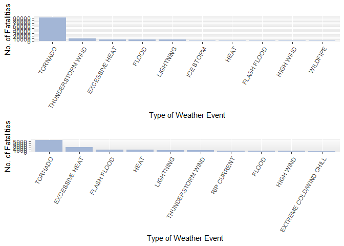
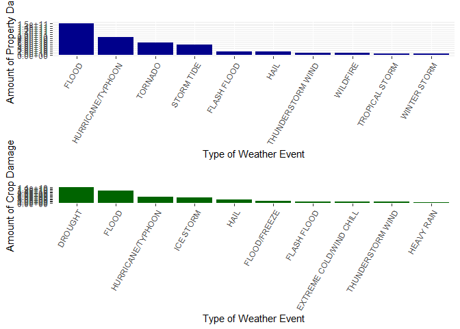

## Data Processing
### Reading the data
The data was loaded directly from the zipped file and stored in a data table to be maniputlated using the *dplyr* package.


```r
        library(dplyr)
```

```
## 
## Attaching package: 'dplyr'
```

```
## The following objects are masked from 'package:stats':
## 
##     filter, lag
```

```
## The following objects are masked from 'package:base':
## 
##     intersect, setdiff, setequal, union
```

```r
        stormdata <- tbl_df(read.csv("repdata_data_StormData.csv.bz2", stringsAsFactors = FALSE))
```

### Processing the data

The documentation provided with the data describes 48 different event types. However, there are 985 uniques values in the EVTYPE variable.  


```r
        length(unique(stormdata$EVTYPE))
```

```
## [1] 985
```

There were several variations of each event type due to incorrect spelling, variations of the same name etc.  

Some of these eroneous event type names were replaced, but only those that might affect the results of the analysis.  A description of what was done, as well as justification of changes made are provided in the sections below.

#### Processing the data to determine how events affect Population Health
The FATALITIES and INJURIES variables were used to show how the various weather events affect population health.  Some of the event types were changed to match what was in the documentation.

JUSTIFICATION FOR REPLACING SOME EVENT TYPE NAMES
A vector with the 48 event types described in the documentation was created.  The raw data was then filtered to obtain those rows with event types that are not included in this vector. The proportions of FATALITIES and INJURIES attributed to these event types were then calculated.


```r
        event_types <- c("ASTRONOMICAL LOW TIDE", "AVALANCHE", "BLIZZARD", "COASTAL FLOOD", "COLD/WIND CHILL", "DEBRIS FLOW", "DENSE FOG", "DENSE SMOKE", "DROUGHT", "DUST DEVIL", "DUST STORM", "EXCESSIVE HEAT", "EXTREME COLD/WIND CHILL", "FLASH FLOOD", "FLOOD", "FREEZING FOG", "FROST/FREEZE", "FUNNEL CLOUD", "HAIL", "HEAT", "HEAVY RAIN", "HEAVY SNOW", "HIGH SURF", "HIGH WIND", "HURRICANE/TYPHOON", "ICE STORM", "LAKESHORE FLOOD", "LAKE-EFFECT SNOW", "LIGHTNING", "MARINE HAIL", "MARINE HIGH WIND", "MARINE STRONG WIND", "MARINE THUNDERSTORM WIND", "RIP CURRENT", "SEICHE", "SLEET", "STORM TIDE", "STRONG WIND", "THUNDERSTORM WIND", "TORNADO", "TROPICAL DEPRESSION", "TROPICAL STORM", "TSUNAMI", "VOLCANIC ASH", "WATERSPOUT", "WILDFIRE", "WINTER STORM", "WINTER WEATHER")

        diffEvents <- filter(stormdata, !(EVTYPE %in% event_types))
        
        sum(diffEvents$FATALITIES)/sum(stormdata$FATALITIES)
```

```
## [1] 0.1344998
```

```r
        sum(diffEvents$INJURIES)/sum(stormdata$INJURIES)
```

```
## [1] 0.08943413
```

About 13% of fatalities and 9% of injuries can be attributed to events with names not in the documentation.  These amounts are large enough to justify replacing some of these names with the documented names.  Only the names of those events with numbers of fatalities or injuries greater than 100 were replaced.


```r
        # Filter all rows where event name is not in documentation and injuries are not 0
                storm_i <- filter(stormdata, !(EVTYPE %in% event_types) & INJURIES != 0)

        # Sum injuries for each event type, and arrange in descending order
                isum <- storm_i %>%
                        group_by(EVTYPE) %>%
                        summarise (inj_sum = sum(INJURIES)) %>%
                        arrange(desc(inj_sum))
        
        # Filter rows where injuries are over 100
                morethan100_i <- filter(isum, !(EVTYPE %in% event_types) & inj_sum >100)
```

There were 14 event names that were selected to be replaced.  


```r
        # Select unique event names with injuries over 100
                unique(morethan100_i$EVTYPE)
```

```
##  [1] "TSTM WIND"          "THUNDERSTORM WINDS" "FOG"               
##  [4] "WILD/FOREST FIRE"   "HEAT WAVE"          "HIGH WINDS"        
##  [7] "RIP CURRENTS"       "EXTREME COLD"       "GLAZE"             
## [10] "EXTREME HEAT"       "WILD FIRES"         "ICE"
```

The raw dataset was copied to **sd_edited** to be processed.     


```r
        # Raw data copied
                sd_edited <- stormdata
        
        # Ensure all values in the EVTYPE variable are in upper case
                sd_edited$EVTYPE <- toupper(sd_edited$EVTYPE)
        
        # Begin substitutions
                sd_edited$EVTYPE <- gsub("^TSTM WIND$|^THUNDERSTORM WINDS$", "THUNDERSTORM WIND", sd_edited$EVTYPE)
                sd_edited$EVTYPE <- gsub("^FOG$", "DENSE FOG", sd_edited$EVTYPE)
                sd_edited$EVTYPE <- gsub("^WILD/FOREST FIRE$|^WILD FIRES$", "WILDFIRE", sd_edited$EVTYPE)
                sd_edited$EVTYPE <- gsub("^HEAT WAVE$|^EXTREME HEAT$", "EXCESSIVE HEAT", sd_edited$EVTYPE)
                sd_edited$EVTYPE <- gsub("^HIGH WINDS$|^STRONG WINDS$|^STRONG WIND$", "HIGH WIND", sd_edited$EVTYPE)
                sd_edited$EVTYPE <- gsub("^RIP CURRENTS$", "RIP CURRENT", sd_edited$EVTYPE)
                sd_edited$EVTYPE <- gsub("^EXTREME COLD$", "EXTREME COLD/WIND CHILL", sd_edited$EVTYPE)
                sd_edited$EVTYPE <- gsub("^GLAZE$", "FROST/FREEZE", sd_edited$EVTYPE)
                sd_edited$EVTYPE <- gsub("^ICE$", "ICE STORM", sd_edited$EVTYPE)
```

Similar code was used to to check the fatalities.


```r
        storm_f <- filter(sd_edited, FATALITIES != 0)

        fsum <- storm_f %>%
                group_by(EVTYPE) %>%
                summarise (fat_sum = sum(FATALITIES)) %>%
                arrange(desc(fat_sum))
        
        morethan100_f <- filter(fsum, !(EVTYPE %in% event_types) & fat_sum >100)
        
        unique(morethan100_f$EVTYPE)
```

```
## character(0)
```

There were no further event names to be replaced.


#### Processing the data to show how events affect the economy

VARIABLES TO BE USED
The following variables were used to determine how each event affects the economy:
* PROPDMG - contains figures representing estimates of the damage done to property
* PROPDMGEXP - an alpha character that signifies the magnitude of the amounts in PROPDMG, ie.
        + H - hundreds
        + K - thousands
        + M - millions
        + B - billions
* CROPDMG - contains figure representing estimates of the damage done to crops
* CROPDMGEXP - an alpha character that signifies the magnitude of the amounts in CROPDMG.  The values are the same as for PROPDMGEXP.

CHECKING PROPDMGEXP AND CROPDMGEXP
The values of the PROPDMGEXP were checked for validity.


```r
        # to check what the property damage data looks like
                propdata <- sd_edited %>%
                        group_by(PROPDMGEXP) %>%
                        summarise (prop_sum = sum(PROPDMG)) %>%
                        arrange(desc(prop_sum))
                propdata
```

```
## # A tibble: 19 x 2
##    PROPDMGEXP   prop_sum
##    <chr>           <dbl>
##  1 K          10735292. 
##  2 M            140694. 
##  3 0              7108. 
##  4 ""              527. 
##  5 B               276. 
##  6 5               210. 
##  7 +               117  
##  8 7                82  
##  9 6                65  
## 10 m                38.9
## 11 H                25  
## 12 3                20  
## 13 -                15  
## 14 4                14.5
## 15 2                12  
## 16 h                 2  
## 17 ?                 0  
## 18 1                 0  
## 19 8                 0
```

Some of the PROPDMGEXP values seem invalid.  These include digits "0" to "8", "-", "?", "+". There is nothing in the documentation to indicate what these characters mean so unfortunately for the purposes of this analysis they have to be ignored.  

A similar exercise was done for the CROPDMGEXP variable.


```r
       # To check what the crop damage data looks like
                cropdata <- sd_edited %>%
                        group_by(CROPDMGEXP) %>%
                        summarise (crop_sum = sum(CROPDMG)) %>%
                        arrange(desc(crop_sum))
                cropdata
```

```
## # A tibble: 9 x 2
##   CROPDMGEXP  crop_sum
##   <chr>          <dbl>
## 1 K          1342956. 
## 2 M            34141. 
## 3 k              436  
## 4 0              260  
## 5 B               13.6
## 6 ""              11  
## 7 m               10  
## 8 ?                0  
## 9 2                0
```

Similarly, as with PROPDMGEXP, the seemingly invalid characters in CROPDMGEXP will have to be ignored as no information could be found in the documentation describing what these characters represent.

SELECT DATA TO BE USED FOR ANALYSIS

The columns and rows to be used for the analysis were selected. The columns listed previously were selected and the rows included were only those with upper- and lower-case K's, M's and B's.  Hundreds were excluded as those values were too small to have an effect on the top ten events to be selected for the plot.


```r
        # Select the appropriate columns
                econtmp <- select(sd_edited, EVTYPE, PROPDMG, PROPDMGEXP, CROPDMG, CROPDMGEXP)

        # Filter required rows 
                prop <- filter(econtmp, PROPDMGEXP %in% c("B", "b", "M", "m", "K", "k"))
                crop <- filter(econtmp, CROPDMGEXP %in% c("B", "b", "M", "m", "K", "k"))
```

CALCULATE DAMAGES
The characters "K", "M" and "B" ,in PROPDMGEXP and CROPDMGEXP, were replaced with the corresponding numeric values so that the dollar values of the damages can be calculated.


```r
        prop$PROPDMGEXP <- gsub("K", 1000, prop$PROPDMGEXP, ignore.case = TRUE)
        prop$PROPDMGEXP <- gsub("M", 1e+06, prop$PROPDMGEXP, ignore.case = TRUE)
        prop$PROPDMGEXP <- gsub("B", 1e+09, prop$PROPDMGEXP, ignore.case = TRUE)
        prop$PROPDMGEXP <- as.numeric(prop$PROPDMGEXP)
                
        crop$CROPDMGEXP <- gsub("K", 1000, crop$CROPDMGEXP, ignore.case = TRUE)
        crop$CROPDMGEXP <- gsub("M", 1e+06, crop$CROPDMGEXP, ignore.case = TRUE)
        crop$CROPDMGEXP <- gsub("B", 1e+09, crop$CROPDMGEXP, ignore.case = TRUE)
        crop$CROPDMGEXP <- as.numeric(crop$CROPDMGEXP)        

        # Calculate damages
        prop <- mutate(prop, propDamages = PROPDMG * PROPDMGEXP)
        crop <- mutate(crop, cropDamages = CROPDMG * CROPDMGEXP)
```

CHECK DAMAGE AMOUNT AGAINST THE EVENT NAMES
The damage aamouts were checked against the event names to determine if there were any events not mentioned in the documentation in the top 10.

Property damage


```r
        #?
                propOrdered <- prop %>%
                        group_by(EVTYPE) %>%
                        summarise (p_sum = sum(propDamages)) %>%
                        arrange(desc(p_sum))
                #
                morethan100_p <- filter(propOrdered, !(EVTYPE %in% event_types) & p_sum >1e+8)
        
                unique(morethan100_p$EVTYPE)
```

```
##  [1] "STORM SURGE"                "HURRICANE"                 
##  [3] "RIVER FLOOD"                "STORM SURGE/TIDE"          
##  [5] "HURRICANE OPAL"             "HEAVY RAIN/SEVERE WEATHER" 
##  [7] "TORNADOES, TSTM WIND, HAIL" "SEVERE THUNDERSTORM"       
##  [9] "TYPHOON"                    "LANDSLIDE"                 
## [11] "FLASH FLOODING"             "FLASH FLOOD/FLOOD"         
## [13] "HURRICANE ERIN"             "HAILSTORM"                 
## [15] "FLOOD/FLASH FLOOD"          "COASTAL FLOODING"          
## [17] "RIVER FLOODING"             "HIGH WINDS/COLD"           
## [19] "FLOODING"                   "MAJOR FLOOD"               
## [21] "WILDFIRES"
```


```r
                prop$EVTYPE <- gsub("^HURRICANE .*|^HURRICANE$|^TYPHOON$", "HURRICANE/TYPHOON", prop$EVTYPE)
                prop$EVTYPE <- gsub("^LANDSLIDE$", "DEBRIS FLOW", prop$EVTYPE)
                prop$EVTYPE <- gsub("^COASTAL FLOODING$", "COASTAL FLOOD", prop$EVTYPE)
                prop$EVTYPE <- gsub("^STORM SURGE.*", "STORM TIDE", prop$EVTYPE)
                prop$EVTYPE <- gsub("^FLASH FLOOD/.*|FLASH FLOODING", "FLASH FLOOD", prop$EVTYPE)
                prop$EVTYPE <- gsub("^RIVER FLOOD.*|^FLOOD.*|^MAJOR FLOOD$", "FLOOD", prop$EVTYPE)
                prop$EVTYPE <- gsub("^SEVERE THUNDERSTORM$|HEAVY RAIN.*", "HEAVY RAIN", prop$EVTYPE)
                prop$EVTYPE <- gsub("^TORNADOES.*", "TORNADO", prop$EVTYPE)
                prop$EVTYPE <- gsub("^HAILSTORM$", "HAIL", prop$EVTYPE)
                prop$EVTYPE <- gsub("^WILDFIRES$", "WILDFIRE", prop$EVTYPE)
                prop$EVTYPE <- gsub("^HIGH WINDS.*", "HIGH WIND", prop$EVTYPE)
```

Crop damage

```r
        #?
                cropOrdered <- crop %>%
                        group_by(EVTYPE) %>%
                        summarise (c_sum = sum(cropDamages)) %>%
                        arrange(desc(c_sum))
                #
                morethan100_c <- filter(cropOrdered, !(EVTYPE %in% event_types) & c_sum >1e+8)
        
                unique(morethan100_c$EVTYPE)
```

```
## [1] "RIVER FLOOD"       "HURRICANE"         "FREEZE"           
## [4] "DAMAGING FREEZE"   "EXCESSIVE WETNESS" "HURRICANE ERIN"   
## [7] "FLOOD/RAIN/WINDS"
```


```r
                crop$EVTYPE <- gsub("^HURRICANE .*|^HURRICANE$", "HURRICANE/TYPHOON", crop$EVTYPE)
                crop$EVTYPE <- gsub("^RIVER FLOOD.*|FLOOD/RAIN.*", "FLOOD", crop$EVTYPE)
                crop$EVTYPE <- gsub("^FREEZE$|.*FREEZE$", "FLOOD/FREEZE", crop$EVTYPE)
                crop$EVTYPE <- gsub("^EXCESSIVE WETNESS$", "HEAVY RAIN", crop$EVTYPE)
```


## Results
### Question 1: Across the United States, which types of events are most harmful with respect to population health?

The edited database, **sd_edited**, was used to create a plot showing the events harmful to the population.  The FATALITIES and INJURIES variables were used to show this.

First the injuries were plotted against event type.


```r
        # Group by Event type, sum injuries for each event and arrange in descending order
                inj_ordered <- sd_edited %>%
                        group_by(EVTYPE) %>%
                        summarise (inj_sum = sum(INJURIES)) %>%
                        arrange(desc(inj_sum))
        
        # Take the top 10 events
                inj_plotdata <- head(inj_ordered, 10)
        
        # Make EVTYPE an ordered factor so that ggplot does not re-order it
                inj_plotdata$EVTYPE <- factor(inj_plotdata$EVTYPE, levels = inj_plotdata$EVTYPE)

        # Plot injuries
                library(ggplot2)
                injPlot <- ggplot(inj_plotdata, aes(EVTYPE, inj_sum)) +
                        geom_bar(stat = "identity", fill = "#a3b6d6") +
                        scale_y_continuous(name = "No. of Fatalities", breaks=seq(0, 1e+5, 1e+4)) +
                        xlab("Type of Weather Event") +
                        theme(axis.text.x = element_text(angle = 60, hjust = 1)) +
                        ylab("Number of Injuries") +
                        ggtitle("")
```

Fatalities were then plotted against event type.


```r
        # Group by Event type, sum fatalities for each event and arrange in descending order
                fat_ordered <- sd_edited %>%
                        group_by(EVTYPE) %>%
                        summarise (fat_sum = sum(FATALITIES)) %>%
                        arrange(desc(fat_sum))
        
        # Take the top 10 events
                fat_plotdata <- head(fat_ordered, 10)
        
        # Make EVTYPE an ordered factor so that ggplot does not re-order it
                fat_plotdata$EVTYPE <- factor(fat_plotdata$EVTYPE, levels = fat_plotdata$EVTYPE)

        # Plot fatalities
                fatPlot <- ggplot(fat_plotdata, aes(EVTYPE, fat_sum)) +
                        geom_bar(stat = "identity", fill = "#a3b6d6") +
                        scale_y_continuous(name = "No. of Fatalities", breaks=seq(0, 10000, 1000)) +
                        xlab("Type of Weather Event") +
                        theme(axis.text.x = element_text(angle = 60, hjust = 1)) +
                        #ylab("Number of Fatalities") +
                        ggtitle("")
```

Both plots were then displayed in one panel.


```r
        library(gridExtra)
```

```
## Warning: package 'gridExtra' was built under R version 3.6.1
```

```
## 
## Attaching package: 'gridExtra'
```

```
## The following object is masked from 'package:dplyr':
## 
##     combine
```

```r
        grid.arrange(injPlot, fatPlot, nrow = 2)
```

<!-- -->


## Question 2: Across the United States, which types of events have the greatest economic consequences?

## Plot Property Damage against event type

The data in **prop**was grouped by EVTYPE and ordered by the sum of the damages for each event type.  The top 10 events were then selected.


```r
        # included above?
                propOrdered <- prop %>%
                        group_by(EVTYPE) %>%
                        summarise (p_sum = sum(propDamages)) %>%
                        arrange(desc(p_sum))

        # Take the top 10 events
                prop_plotdata <- head(propOrdered, 10)
        
        # Make EVTYPE an ordered factor so that ggplot does not re-order it
                prop_plotdata$EVTYPE <- factor(prop_plotdata$EVTYPE, levels = prop_plotdata$EVTYPE)

        # Plot property damage
                propPlot <- ggplot(prop_plotdata, aes(EVTYPE, p_sum)) +
                        geom_bar(stat = "identity", fill = "dark blue") +
                        scale_y_continuous(name = "Amount of Property Damage", breaks=seq(0, 1.5e+11, 1e+10)) +
                        xlab("Type of Weather Event") +
                        theme(axis.text.x = element_text(angle = 60, hjust = 1)) +
                        #ylab("Number of Fatalities") +
                        ggtitle("")
```

## Plot Crop Damage against event type

The data was then grouped by EVTYPE and ordered by the sum of the damages for each event type.  The top 10 events were then selected.


```r
        # ?
                cropOrdered <- crop %>%
                                group_by(EVTYPE) %>%
                                summarise (c_sum = sum(cropDamages)) %>%
                                arrange(desc(c_sum))

        # Take the top 10 events
                crop_plotdata <- head(cropOrdered, 10)
        
        # Make EVTYPE an ordered factor so that ggplot does not re-order it
                crop_plotdata$EVTYPE <- factor(crop_plotdata$EVTYPE, levels = crop_plotdata$EVTYPE)

        # Plot crop damage
                cropPlot <- ggplot(crop_plotdata, aes(EVTYPE, c_sum)) +
                        geom_bar(stat = "identity", fill = "dark green") +
                        scale_y_continuous(name = "Amount of Crop Damage", breaks=seq(0, 1.4e+10, 1e+9)) +
                        xlab("Type of Weather Event") +
                        theme(axis.text.x = element_text(angle = 60, hjust = 1)) +
                        #ylab("Number of Fatalities") +
                        ggtitle("")
```

### Arrange both plots in one panel


```r
        library(gridExtra)
        grid.arrange(propPlot, cropPlot, nrow = 2)
```

<!-- -->


