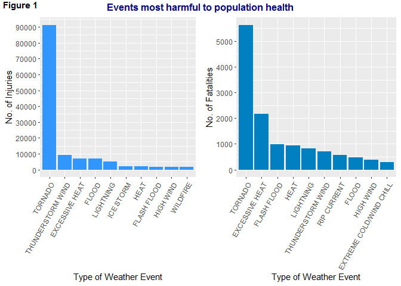

# Synopsis


# Data Processing

## Loading the data
The data was loaded directly from the zipped file and stored in a data table to be manipulated using the *dplyr* package.


```r
        library(dplyr)
```

```
## 
## Attaching package: 'dplyr'
```

```
## The following objects are masked from 'package:stats':
## 
##     filter, lag
```

```
## The following objects are masked from 'package:base':
## 
##     intersect, setdiff, setequal, union
```

```r
        stormdata <- tbl_df(read.csv("repdata_data_StormData.csv.bz2"))
```

## Processing the data

The documentation provided with the data describes 48 different event types. However, there are 985 uniques values in the EVTYPE variable.  


```r
        length(unique(stormdata$EVTYPE))
```

```
## [1] 985
```

There seemed to be several variations of each event type due to incorrect spelling, variations of the same name, combinations of names etc.  

Some of these erroneous event type names were replaced, but only those that might affect the results of the analysis.  A description of what was done, as well as justification of changes made are provided in the sections below.


### Processing the data to determine how events affect Population Health
The FATALITIES and INJURIES variables were used to show how the various weather events affect population health.  Since there were so many more event type names in the dataset compared to the document, some checks were done to see how these 'other' names contribute to the numbers of fatalities and injuries.


#### Justification for replacing event names - checking injuries and fatalities
A vector with the 48 event types described in the documentation was created.  The raw data was then filtered to obtain those rows with event types that are not included in this vector. The proportions of FATALITIES and INJURIES attributed to these event types were then calculated.


```r
        event_types <- c("ASTRONOMICAL LOW TIDE", "AVALANCHE", "BLIZZARD", "COASTAL FLOOD", "COLD/WIND CHILL", "DEBRIS FLOW", "DENSE FOG", "DENSE SMOKE", "DROUGHT", "DUST DEVIL", "DUST STORM", "EXCESSIVE HEAT", "EXTREME COLD/WIND CHILL", "FLASH FLOOD", "FLOOD", "FREEZING FOG", "FROST/FREEZE", "FUNNEL CLOUD", "HAIL", "HEAT", "HEAVY RAIN", "HEAVY SNOW", "HIGH SURF", "HIGH WIND", "HURRICANE/TYPHOON", "ICE STORM", "LAKESHORE FLOOD", "LAKE-EFFECT SNOW", "LIGHTNING", "MARINE HAIL", "MARINE HIGH WIND", "MARINE STRONG WIND", "MARINE THUNDERSTORM WIND", "RIP CURRENT", "SEICHE", "SLEET", "STORM TIDE", "STRONG WIND", "THUNDERSTORM WIND", "TORNADO", "TROPICAL DEPRESSION", "TROPICAL STORM", "TSUNAMI", "VOLCANIC ASH", "WATERSPOUT", "WILDFIRE", "WINTER STORM", "WINTER WEATHER")

        diffEvents <- filter(stormdata, !(EVTYPE %in% event_types))
        
        sum(diffEvents$FATALITIES)/sum(stormdata$FATALITIES)
```

```
## [1] 0.1344998
```

```r
        sum(diffEvents$INJURIES)/sum(stormdata$INJURIES)
```

```
## [1] 0.08943413
```

About 13% of fatalities and 9% of injuries can be attributed to events with names not in the documentation.  These amounts are large enough to justify replacing some of these names with the documented names.  


#### Description of the selection process for replacing event names
Note that the top 10 events will be selected for the plots.  With respect to the erroneous names, only the names of those events with numbers of fatalities or injuries greater than 100 were replaced.  Amounts less that 100 should not affect the top ten events.  

The following process was followed:
* Filter all rows for events which are not in the documentation and where the amount is greater than 0
* FInd the sum for each event type
* Filter rows where the sum is greater than 100.
* Replace event names in these rows if any

The INJURIES variable was checked first.


```r
        # Filter all rows where event name is not in documentation and injuries are not 0
                storm_i <- filter(stormdata, !(EVTYPE %in% event_types) & INJURIES != 0)

        # Sum injuries for each event type, and arrange in descending order
                isum <- storm_i %>%
                        group_by(EVTYPE) %>%
                        summarise (inj_sum = sum(INJURIES)) %>%
                        arrange(desc(inj_sum))
        
        # Filter rows where injuries are over 100
                morethan100_i <- filter(isum, !(EVTYPE %in% event_types) & inj_sum >100)
                
        # Select unique event names with injuries over 100
                unique(morethan100_i$EVTYPE)
```

```
##  [1] TSTM WIND          THUNDERSTORM WINDS FOG               
##  [4] WILD/FOREST FIRE   HEAT WAVE          HIGH WINDS        
##  [7] RIP CURRENTS       EXTREME COLD       GLAZE             
## [10] EXTREME HEAT       WILD FIRES         ICE               
## 985 Levels:    HIGH SURF ADVISORY  COASTAL FLOOD ... WND
```

There were 14 event names that were selected to be replaced.  

The raw dataset was copied to **sd_edited** and event names were replaced in this copied dataset.     


```r
        # Raw data copied
                sd_edited <- stormdata
        
        # Ensure all values in the EVTYPE variable are in upper case
                sd_edited$EVTYPE <- toupper(sd_edited$EVTYPE)
        
        # Replace event names
                sd_edited$EVTYPE <- gsub("^TSTM WIND$|^THUNDERSTORM WINDS$", "THUNDERSTORM WIND", 
                                         sd_edited$EVTYPE)
                sd_edited$EVTYPE <- gsub("^FOG$", "DENSE FOG", sd_edited$EVTYPE)
                sd_edited$EVTYPE <- gsub("^WILD/FOREST FIRE$|^WILD FIRES$", "WILDFIRE", 
                                         sd_edited$EVTYPE)
                sd_edited$EVTYPE <- gsub("^HEAT WAVE$|^EXTREME HEAT$", "EXCESSIVE HEAT", 
                                         sd_edited$EVTYPE)
                sd_edited$EVTYPE <- gsub("^HIGH WINDS$|^STRONG WINDS$|^STRONG WIND$", "HIGH WIND", 
                                         sd_edited$EVTYPE)
                sd_edited$EVTYPE <- gsub("^RIP CURRENTS$", "RIP CURRENT", sd_edited$EVTYPE)
                sd_edited$EVTYPE <- gsub("^EXTREME COLD$", "EXTREME COLD/WIND CHILL", 
                                         sd_edited$EVTYPE)
                sd_edited$EVTYPE <- gsub("^GLAZE$", "FROST/FREEZE", sd_edited$EVTYPE)
                sd_edited$EVTYPE <- gsub("^ICE$", "ICE STORM", sd_edited$EVTYPE)
```

Similar code was used to to check the FATALTIES variable.


```r
        # Filter all rows where event name is not in documentation and injuries are not 0
                storm_f <- filter(sd_edited, FATALITIES != 0)

        # Sum injuries for each event type, and arrange in descending order
                fsum <- storm_f %>%
                        group_by(EVTYPE) %>%
                        summarise (fat_sum = sum(FATALITIES)) %>%
                        arrange(desc(fat_sum))
       
        # Filter rows where fatalities are over 100 
                morethan100_f <- filter(fsum, !(EVTYPE %in% event_types) & fat_sum >100)
        
        # Select unique event names with fatalities over 100
                unique(morethan100_f$EVTYPE)
```

```
## character(0)
```

There were no further event names to be replaced.


### Processing the data to show how events affect the economy

The following variables were used to determine how each event affects the economy:

* PROPDMG - contains figures representing estimates of the damage done to property
* PROPDMGEXP - an alpha character that signifies the magnitude of the amounts in PROPDMG, ie.
        + H - hundreds
        + K - thousands
        + M - millions
        + B - billions
* CROPDMG - contains figures representing estimates of the damage done to crops
* CROPDMGEXP - an alpha character that signifies the magnitude of the amounts in CROPDMG.  The values are the same as for PROPDMGEXP.

Note that going forward the updated **sd_edited** dataset was used for all future processing.


#### Checking PROPDMGEXP and CROPDMGEXP
PROPDMGEXP and CROPDMGEXP variables were checked to ensure that they contain only H, K, M or B.  


```r
        unique(sd_edited$PROPDMGEXP)
```

```
##  [1] K M   B m + 0 5 6 ? 4 2 3 h 7 H - 1 8
## Levels:  - ? + 0 1 2 3 4 5 6 7 8 B h H K m M
```

```r
        unique(sd_edited$CROPDMGEXP)
```

```
## [1]   M K m B ? 0 k 2
## Levels:  ? 0 2 B k K m M
```

There are a few values which did not seem valid.  Since there is nothing in the documentation to indicate what these characters mean,  for the purposes of this analysis they were ignored.  


#### Justification for replacing event names - checking property and crop damage

For both property and crops, events that are not in the documentation were checked to see how much they contribute to total damages.  Note that only the ten events witht he highest amount of damages will be considered.

The data required was separated into 2 datasets: **prop** and **crop**.

The following process was used:

* Select only the columns that will be used in the analysis: EVTYPE, PROPDMG, PROPDMGEXP, CROPDMG, CROPDMGEXP.

* Valid rows, ie. those where the damage magnitude is B, M or K, were filtered separately into **prop** and **crop**.  Hundreds (where PROPDMGEXP and CROPDMGEXP were 'H') were excluded as those values were too small to have an effect on the top ten events to be selected for the plot.

* The damage magnitude characters were substituted with corresponding numerical values:
+ B or b was replaced with 1 000 000 000
+ M or m was replaced with 1 000 000
+ K or k was replaced with 1 000

* Damages were calculated and added to a new column in each dataset.

* Filter those rows with events which are not in the documentation.

* Sum the damages and find the proporation of the total damages for each dataset.


```r
        # Select the appropriate columns
                econtmp <- select(sd_edited, EVTYPE, PROPDMG, PROPDMGEXP, CROPDMG, CROPDMGEXP)

        # Filter required rows 
                prop <- filter(econtmp, PROPDMGEXP %in% c("B", "b", "M", "m", "K", "k"))
                crop <- filter(econtmp, CROPDMGEXP %in% c("B", "b", "M", "m", "K", "k"))
        
        # Substitute the characters with numerical values
                prop$PROPDMGEXP <- gsub("K", 1000, prop$PROPDMGEXP, ignore.case = TRUE)
                prop$PROPDMGEXP <- gsub("M", 1e+06, prop$PROPDMGEXP, ignore.case = TRUE)
                prop$PROPDMGEXP <- gsub("B", 1e+09, prop$PROPDMGEXP, ignore.case = TRUE)
                prop$PROPDMGEXP <- as.numeric(prop$PROPDMGEXP)
                        
                crop$CROPDMGEXP <- gsub("K", 1000, crop$CROPDMGEXP, ignore.case = TRUE)
                crop$CROPDMGEXP <- gsub("M", 1e+06, crop$CROPDMGEXP, ignore.case = TRUE)
                crop$CROPDMGEXP <- gsub("B", 1e+09, crop$CROPDMGEXP, ignore.case = TRUE)
                crop$CROPDMGEXP <- as.numeric(crop$CROPDMGEXP)        

        # Calculate damages
                prop <- mutate(prop, propDamages = PROPDMG * PROPDMGEXP)
                crop <- mutate(crop, cropDamages = CROPDMG * CROPDMGEXP)

        # Filter rows for events not in the documentation
                diffEventsProp <- filter(prop, !(EVTYPE %in% event_types))
                diffEventsCrop <- filter(crop, !(EVTYPE %in% event_types))
        
        # FInd proportion of total contribution
                sum(diffEventsProp$propDamages)/sum(prop$propDamages)
```

```
## [1] 0.1803346
```

```r
                sum(diffEventsCrop$cropDamages)/sum(crop$cropDamages)
```

```
## [1] 0.1962875
```

About 18% of property damage and 20% of crop damage can be attributed to events with names not in the documentation.  These amounts are large enough to justify replacing some of these names with the documented names.  


#### Description of the selection process for replacing event names
Again only the top 10 events were selected for the plot.  With respect to the event names not included in the documentation, only those where the sum of the damages is greater that 100 million were replaced.  Total damages less than this amount will not affect the top ten events as those amounts are very large.

**prop** was processed first.


```r
        # Filter events not in documentation and greater than 100 million
                propOrdered <- prop %>%
                        group_by(EVTYPE) %>%
                        summarise (p_sum = sum(propDamages)) %>%
                        arrange(desc(p_sum))
                
                morethan100M_p <- filter(propOrdered, !(EVTYPE %in% event_types) & p_sum >1e+8)
        
                unique(morethan100M_p$EVTYPE)
```

```
##  [1] "STORM SURGE"                "HURRICANE"                 
##  [3] "RIVER FLOOD"                "STORM SURGE/TIDE"          
##  [5] "HURRICANE OPAL"             "HEAVY RAIN/SEVERE WEATHER" 
##  [7] "TORNADOES, TSTM WIND, HAIL" "SEVERE THUNDERSTORM"       
##  [9] "TYPHOON"                    "LANDSLIDE"                 
## [11] "FLASH FLOODING"             "FLASH FLOOD/FLOOD"         
## [13] "HURRICANE ERIN"             "HAILSTORM"                 
## [15] "FLOOD/FLASH FLOOD"          "COASTAL FLOODING"          
## [17] "RIVER FLOODING"             "HIGH WINDS/COLD"           
## [19] "FLOODING"                   "MAJOR FLOOD"               
## [21] "WILDFIRES"
```

```r
        # Replace event names
                prop$EVTYPE <- gsub("^HURRICANE .*|^HURRICANE$|^TYPHOON$", "HURRICANE/TYPHOON", 
                                    prop$EVTYPE)
                prop$EVTYPE <- gsub("^LANDSLIDE$", "DEBRIS FLOW", prop$EVTYPE)
                prop$EVTYPE <- gsub("^COASTAL FLOODING$", "COASTAL FLOOD", prop$EVTYPE)
                prop$EVTYPE <- gsub("^STORM SURGE.*", "STORM TIDE", prop$EVTYPE)
                prop$EVTYPE <- gsub("^FLASH FLOOD/.*|FLASH FLOODING", "FLASH FLOOD", prop$EVTYPE)
                prop$EVTYPE <- gsub("^RIVER FLOOD.*|^FLOOD.*|^MAJOR FLOOD$", "FLOOD", prop$EVTYPE)
                prop$EVTYPE <- gsub("^SEVERE THUNDERSTORM$|HEAVY RAIN.*", "HEAVY RAIN", prop$EVTYPE)
                prop$EVTYPE <- gsub("^TORNADOES.*", "TORNADO", prop$EVTYPE)
                prop$EVTYPE <- gsub("^HAILSTORM$", "HAIL", prop$EVTYPE)
                prop$EVTYPE <- gsub("^WILDFIRES$", "WILDFIRE", prop$EVTYPE)
                prop$EVTYPE <- gsub("^HIGH WINDS.*", "HIGH WIND", prop$EVTYPE)
```

A similar exercise was done with **crop**.


```r
       # Filter events not in documentation and greater than 100 million        
                cropOrdered <- crop %>%
                        group_by(EVTYPE) %>%
                        summarise (c_sum = sum(cropDamages)) %>%
                        arrange(desc(c_sum))
                
                morethan100M_c <- filter(cropOrdered, !(EVTYPE %in% event_types) & c_sum >1e+8)
        
                unique(morethan100M_c$EVTYPE)
```

```
## [1] "RIVER FLOOD"       "HURRICANE"         "FREEZE"           
## [4] "DAMAGING FREEZE"   "EXCESSIVE WETNESS" "HURRICANE ERIN"   
## [7] "FLOOD/RAIN/WINDS"
```

```r
        # Replace event names
                crop$EVTYPE <- gsub("^HURRICANE .*|^HURRICANE$", "HURRICANE/TYPHOON", crop$EVTYPE)
                crop$EVTYPE <- gsub("^RIVER FLOOD.*|FLOOD/RAIN.*", "FLOOD", crop$EVTYPE)
                crop$EVTYPE <- gsub("^FREEZE$|.*FREEZE$", "FLOOD/FREEZE", crop$EVTYPE)
                crop$EVTYPE <- gsub("^EXCESSIVE WETNESS$", "HEAVY RAIN", crop$EVTYPE)
```


# Results
## Question 1: Across the United States, which types of events are most harmful with respect to population health?

The edited database, **sd_edited**, was used to create a plot showing the events harmful to the population.  As mentioned previously, the FATALITIES and INJURIES variables were used to show this.

First, the injuries were plotted against event type in a barchart.


```r
        # Group by Event type, sum injuries for each event and arrange in descending order
                inj_ordered <- sd_edited %>%
                        group_by(EVTYPE) %>%
                        summarise (inj_sum = sum(INJURIES)) %>%
                        arrange(desc(inj_sum))
        
        # Take the top 10 events
                inj_plotdata <- head(inj_ordered, 10)
        
        # Make EVTYPE an ordered factor so that ggplot does not re-order it
                inj_plotdata$EVTYPE <- factor(inj_plotdata$EVTYPE, levels = inj_plotdata$EVTYPE)

        # Plot injuries
                library(ggplot2)
                injPlot <- ggplot(inj_plotdata, aes(EVTYPE, inj_sum)) +
                        geom_bar(stat = "identity", fill = "#3296FF") +
                        scale_y_continuous(name = "No. of Fatalities", breaks=seq(0, 1e+5, 1e+4)) +
                        xlab("Type of Weather Event") +
                        theme(axis.text.x = element_text(angle = 60, hjust = 1)) +
                        ylab("Number of Injuries") +
                        ggtitle("")
```

Fatalities were then plotted against event type.


```r
        # Group by Event type, sum fatalities for each event and arrange in descending order
                fat_ordered <- sd_edited %>%
                        group_by(EVTYPE) %>%
                        summarise (fat_sum = sum(FATALITIES)) %>%
                        arrange(desc(fat_sum))
        
        # Take the top 10 events
                fat_plotdata <- head(fat_ordered, 10)
        
        # Make EVTYPE an ordered factor so that ggplot does not re-order it
                fat_plotdata$EVTYPE <- factor(fat_plotdata$EVTYPE, levels = fat_plotdata$EVTYPE)

        # Plot fatalities
                fatPlot <- ggplot(fat_plotdata, aes(EVTYPE, fat_sum)) +
                        geom_bar(stat = "identity", fill = "#0080C0") +
                        scale_y_continuous(name = "No. of Fatalities", breaks=seq(0, 10000, 1000)) +
                        xlab("Type of Weather Event") +
                        theme(axis.text.x = element_text(angle = 60, hjust = 1)) +
                        #ylab("Number of Fatalities") +
                        ggtitle("")
```

Both charts are displayed in one panel.


```r
        library(ggpubr)
```

```
## Warning: package 'ggpubr' was built under R version 3.6.1
```

```
## Loading required package: magrittr
```

```r
        ggarrange(injPlot, fatPlot, align = "h")
```

<!-- -->

The barcharts show that tornodoes, thunderstorm winds and excessive heat are the top 3 causes of injuries, while tornadoes, excessive heat and flash fllod and the top 3 causes of fatalities.  

Tornadoes, thunderstorm winds, excessive heat, floods, lightning, ?heat? and high winds are the major causes of fatalities.


## Question 2: Across the United States, which types of events have the greatest economic consequences?

First, property damage was plotted against event type in a barchart.


```r
        # Group by event type, sum damages and arrange in descending order
                propOrdered <- prop %>%
                        group_by(EVTYPE) %>%
                        summarise (p_sum = sum(propDamages)) %>%
                        arrange(desc(p_sum))

        # Take the top 10 events
                prop_plotdata <- head(propOrdered, 10)
        
        # Make EVTYPE an ordered factor so that ggplot does not re-order it
                prop_plotdata$EVTYPE <- factor(prop_plotdata$EVTYPE, levels = prop_plotdata$EVTYPE)

        # Plot property damage
                propPlot <- ggplot(prop_plotdata, aes(EVTYPE, p_sum)) +
                        geom_bar(stat = "identity", fill = "#008080") +
                        scale_y_continuous(name = "Amount of Property Damage", 
                                           breaks=seq(0, 1.5e+11, 1e+10)) +
                        xlab("Type of Weather Event") +
                        theme(axis.text.x = element_text(angle = 60, hjust = 1)) +
                        #ylab("Number of Fatalities") +
                        ggtitle("")
```

Crop Damage was then plotted against event type.


```r
        # Group by event type, sum damages and arrange in descending order
                cropOrdered <- crop %>%
                                group_by(EVTYPE) %>%
                                summarise (c_sum = sum(cropDamages)) %>%
                                arrange(desc(c_sum))

        # Take the top 10 events
                crop_plotdata <- head(cropOrdered, 10)
        
        # Make EVTYPE an ordered factor so that ggplot does not re-order it
                crop_plotdata$EVTYPE <- factor(crop_plotdata$EVTYPE, levels = crop_plotdata$EVTYPE)

        # Plot crop damage
                cropPlot <- ggplot(crop_plotdata, aes(EVTYPE, c_sum)) +
                        geom_bar(stat = "identity", fill = "#00CCCC") +
                        scale_y_continuous(name = "Amount of Crop Damage", 
                                           breaks=seq(0, 1.4e+10, 1e+9)) +
                        xlab("Type of Weather Event") +
                        theme(axis.text.x = element_text(angle = 60, hjust = 1)) +
                        #ylab("Number of Fatalities") +
                        ggtitle("")
```

Both plots are displayed in one panel.


```r
        library(ggpubr)
        ggarrange(propPlot, cropPlot, align = "h")
```

<!-- -->

The barcharts show that while flood, hurricanes/typhoons and tornadoes are the top 3 causes of property damage, drought, flood and hurricanes/typhoons are the top 3 causes of damage to crops

Floods, flash floods, hurricanes/typhoons, hail and thunderstorm winds cause substantial damage to both property and crops.

