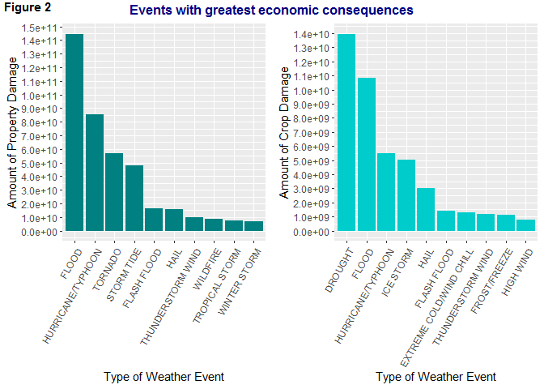

# Synopsis

This report aims to show how severe weather events recorded  during the period 1950 to November 2011 have affected population health and the economy in the United States.  This information is useful so that resources can be prioritised for the different types of events.  Population Health was measured by injuries and fatalities while economic consequences was measured by using cost of damages to property and crops.  It was found that tornadoes, thunderstorm winds, excessive heat, floods and lightning caused the most fatalities and injuries.  Floods, including flash floods, hurricanes/typhoons, hail and thunderstorm winds had the largest economic consequences.


# Loading and Processing the Raw Data
The U.S. National Oceanic and Atmospheric Administration's (NOAA) storm database tracks characteristics of major storms and weather events in the United States, including when and where they occur.  

## Loading the data
The data was in the form of a comma-separated-value file compressed via the bzip2 algorithm.  It was loaded directly from the zipped file.


```r
        library(dplyr)
```

```
## 
## Attaching package: 'dplyr'
```

```
## The following objects are masked from 'package:stats':
## 
##     filter, lag
```

```
## The following objects are masked from 'package:base':
## 
##     intersect, setdiff, setequal, union
```

```r
        stormdata <- tbl_df(read.csv("repdata_data_StormData.csv.bz2"))
```

## Processing the data
The number of rows, columns and structure of the dataset were checked, as well as the first and last few rows.


```r
        dim(stormdata)
```

```
## [1] 902297     37
```

```r
        str(stormdata)
```

```
## Classes 'tbl_df', 'tbl' and 'data.frame':	902297 obs. of  37 variables:
##  $ STATE__   : num  1 1 1 1 1 1 1 1 1 1 ...
##  $ BGN_DATE  : Factor w/ 16335 levels "1/1/1966 0:00:00",..: 6523 6523 4242 11116 2224 2224 2260 383 3980 3980 ...
##  $ BGN_TIME  : Factor w/ 3608 levels "00:00:00 AM",..: 272 287 2705 1683 2584 3186 242 1683 3186 3186 ...
##  $ TIME_ZONE : Factor w/ 22 levels "ADT","AKS","AST",..: 7 7 7 7 7 7 7 7 7 7 ...
##  $ COUNTY    : num  97 3 57 89 43 77 9 123 125 57 ...
##  $ COUNTYNAME: Factor w/ 29601 levels "","5NM E OF MACKINAC BRIDGE TO PRESQUE ISLE LT MI",..: 13513 1873 4598 10592 4372 10094 1973 23873 24418 4598 ...
##  $ STATE     : Factor w/ 72 levels "AK","AL","AM",..: 2 2 2 2 2 2 2 2 2 2 ...
##  $ EVTYPE    : Factor w/ 985 levels "   HIGH SURF ADVISORY",..: 834 834 834 834 834 834 834 834 834 834 ...
##  $ BGN_RANGE : num  0 0 0 0 0 0 0 0 0 0 ...
##  $ BGN_AZI   : Factor w/ 35 levels "","  N"," NW",..: 1 1 1 1 1 1 1 1 1 1 ...
##  $ BGN_LOCATI: Factor w/ 54429 levels "","- 1 N Albion",..: 1 1 1 1 1 1 1 1 1 1 ...
##  $ END_DATE  : Factor w/ 6663 levels "","1/1/1993 0:00:00",..: 1 1 1 1 1 1 1 1 1 1 ...
##  $ END_TIME  : Factor w/ 3647 levels ""," 0900CST",..: 1 1 1 1 1 1 1 1 1 1 ...
##  $ COUNTY_END: num  0 0 0 0 0 0 0 0 0 0 ...
##  $ COUNTYENDN: logi  NA NA NA NA NA NA ...
##  $ END_RANGE : num  0 0 0 0 0 0 0 0 0 0 ...
##  $ END_AZI   : Factor w/ 24 levels "","E","ENE","ESE",..: 1 1 1 1 1 1 1 1 1 1 ...
##  $ END_LOCATI: Factor w/ 34506 levels "","- .5 NNW",..: 1 1 1 1 1 1 1 1 1 1 ...
##  $ LENGTH    : num  14 2 0.1 0 0 1.5 1.5 0 3.3 2.3 ...
##  $ WIDTH     : num  100 150 123 100 150 177 33 33 100 100 ...
##  $ F         : int  3 2 2 2 2 2 2 1 3 3 ...
##  $ MAG       : num  0 0 0 0 0 0 0 0 0 0 ...
##  $ FATALITIES: num  0 0 0 0 0 0 0 0 1 0 ...
##  $ INJURIES  : num  15 0 2 2 2 6 1 0 14 0 ...
##  $ PROPDMG   : num  25 2.5 25 2.5 2.5 2.5 2.5 2.5 25 25 ...
##  $ PROPDMGEXP: Factor w/ 19 levels "","-","?","+",..: 17 17 17 17 17 17 17 17 17 17 ...
##  $ CROPDMG   : num  0 0 0 0 0 0 0 0 0 0 ...
##  $ CROPDMGEXP: Factor w/ 9 levels "","?","0","2",..: 1 1 1 1 1 1 1 1 1 1 ...
##  $ WFO       : Factor w/ 542 levels ""," CI","$AC",..: 1 1 1 1 1 1 1 1 1 1 ...
##  $ STATEOFFIC: Factor w/ 250 levels "","ALABAMA, Central",..: 1 1 1 1 1 1 1 1 1 1 ...
##  $ ZONENAMES : Factor w/ 25112 levels "","                                                                                                               "| __truncated__,..: 1 1 1 1 1 1 1 1 1 1 ...
##  $ LATITUDE  : num  3040 3042 3340 3458 3412 ...
##  $ LONGITUDE : num  8812 8755 8742 8626 8642 ...
##  $ LATITUDE_E: num  3051 0 0 0 0 ...
##  $ LONGITUDE_: num  8806 0 0 0 0 ...
##  $ REMARKS   : Factor w/ 436781 levels "","-2 at Deer Park\n",..: 1 1 1 1 1 1 1 1 1 1 ...
##  $ REFNUM    : num  1 2 3 4 5 6 7 8 9 10 ...
```

```r
        head(stormdata)
```

```
## # A tibble: 6 x 37
##   STATE__ BGN_DATE BGN_TIME TIME_ZONE COUNTY COUNTYNAME STATE EVTYPE
##     <dbl> <fct>    <fct>    <fct>      <dbl> <fct>      <fct> <fct> 
## 1       1 4/18/19~ 0130     CST           97 MOBILE     AL    TORNA~
## 2       1 4/18/19~ 0145     CST            3 BALDWIN    AL    TORNA~
## 3       1 2/20/19~ 1600     CST           57 FAYETTE    AL    TORNA~
## 4       1 6/8/195~ 0900     CST           89 MADISON    AL    TORNA~
## 5       1 11/15/1~ 1500     CST           43 CULLMAN    AL    TORNA~
## 6       1 11/15/1~ 2000     CST           77 LAUDERDALE AL    TORNA~
## # ... with 29 more variables: BGN_RANGE <dbl>, BGN_AZI <fct>,
## #   BGN_LOCATI <fct>, END_DATE <fct>, END_TIME <fct>, COUNTY_END <dbl>,
## #   COUNTYENDN <lgl>, END_RANGE <dbl>, END_AZI <fct>, END_LOCATI <fct>,
## #   LENGTH <dbl>, WIDTH <dbl>, F <int>, MAG <dbl>, FATALITIES <dbl>,
## #   INJURIES <dbl>, PROPDMG <dbl>, PROPDMGEXP <fct>, CROPDMG <dbl>,
## #   CROPDMGEXP <fct>, WFO <fct>, STATEOFFIC <fct>, ZONENAMES <fct>,
## #   LATITUDE <dbl>, LONGITUDE <dbl>, LATITUDE_E <dbl>, LONGITUDE_ <dbl>,
## #   REMARKS <fct>, REFNUM <dbl>
```

```r
        tail(stormdata)
```

```
## # A tibble: 6 x 37
##   STATE__ BGN_DATE BGN_TIME TIME_ZONE COUNTY COUNTYNAME STATE EVTYPE
##     <dbl> <fct>    <fct>    <fct>      <dbl> <fct>      <fct> <fct> 
## 1      47 11/28/2~ 03:00:0~ CST           21 TNZ001>00~ TN    WINTE~
## 2      56 11/30/2~ 10:30:0~ MST            7 WYZ007 - ~ WY    HIGH ~
## 3      30 11/10/2~ 02:48:0~ MST            9 MTZ009 - ~ MT    HIGH ~
## 4       2 11/8/20~ 02:58:0~ AKS          213 AKZ213     AK    HIGH ~
## 5       2 11/9/20~ 10:21:0~ AKS          202 AKZ202     AK    BLIZZ~
## 6       1 11/28/2~ 08:00:0~ CST            6 ALZ006     AL    HEAVY~
## # ... with 29 more variables: BGN_RANGE <dbl>, BGN_AZI <fct>,
## #   BGN_LOCATI <fct>, END_DATE <fct>, END_TIME <fct>, COUNTY_END <dbl>,
## #   COUNTYENDN <lgl>, END_RANGE <dbl>, END_AZI <fct>, END_LOCATI <fct>,
## #   LENGTH <dbl>, WIDTH <dbl>, F <int>, MAG <dbl>, FATALITIES <dbl>,
## #   INJURIES <dbl>, PROPDMG <dbl>, PROPDMGEXP <fct>, CROPDMG <dbl>,
## #   CROPDMGEXP <fct>, WFO <fct>, STATEOFFIC <fct>, ZONENAMES <fct>,
## #   LATITUDE <dbl>, LONGITUDE <dbl>, LATITUDE_E <dbl>, LONGITUDE_ <dbl>,
## #   REMARKS <fct>, REFNUM <dbl>
```

The data seems to have been loaded correctly. 

The documentation provided with the data describes 48 different event types. The number of unique event types in the database was checked.


```r
        length(unique(stormdata$EVTYPE))
```

```
## [1] 985
```

985 uniques values in the EVTYPE column shows a huge variation in how information was entered for this variable.  There seemes to be incorrect spelling, variations of the same name, combinations of several names and so on.  

It was decided that some of these event type names should be replaced with what is in the documentation, but only those that might affect the results of the analysis.  A description of what was done, as well as justification of the changes made are provided in the sections below.


### Processing the data to determine how events affect Population Health
The FATALITIES and INJURIES variables were used to show how weather events affect population health.  Since there were so many more event type names in the dataset compared to what was in the documentation provided, some checks were done to see how these 'other' names contribute to the numbers of fatalities and injuries.


#### Justification for replacing event names - checking injuries and fatalities
A vector with the 48 event types described in the documentation was created.  The raw data was then filtered to obtain those rows with event types that are NOT included in this vector. The proportions of FATALITIES and INJURIES attributed to these invalid event types were then calculated.


```r
        # Create vector of valid event types
                event_types <- c("ASTRONOMICAL LOW TIDE", "AVALANCHE", "BLIZZARD", "COASTAL FLOOD", "COLD/WIND CHILL", "DEBRIS FLOW", "DENSE FOG", "DENSE SMOKE", "DROUGHT", "DUST DEVIL", "DUST STORM", "EXCESSIVE HEAT", "EXTREME COLD/WIND CHILL", "FLASH FLOOD", "FLOOD", "FREEZING FOG", "FROST/FREEZE", "FUNNEL CLOUD", "HAIL", "HEAT", "HEAVY RAIN", "HEAVY SNOW", "HIGH SURF", "HIGH WIND", "HURRICANE/TYPHOON", "ICE STORM", "LAKESHORE FLOOD", "LAKE-EFFECT SNOW", "LIGHTNING", "MARINE HAIL", "MARINE HIGH WIND", "MARINE STRONG WIND", "MARINE THUNDERSTORM WIND", "RIP CURRENT", "SEICHE", "SLEET", "STORM TIDE", "STRONG WIND", "THUNDERSTORM WIND", "TORNADO", "TROPICAL DEPRESSION", "TROPICAL STORM", "TSUNAMI", "VOLCANIC ASH", "WATERSPOUT", "WILDFIRE", "WINTER STORM", "WINTER WEATHER")

        # Filter invalid event types from the data
                invEvents <- filter(stormdata, !(EVTYPE %in% event_types))
        
        # Calculate how much invalid event types contribute to the total fatalities and injuries
                sum(invEvents$FATALITIES)/sum(stormdata$FATALITIES)
```

```
## [1] 0.1344998
```

```r
                sum(invEvents$INJURIES)/sum(stormdata$INJURIES)
```

```
## [1] 0.08943413
```

About 13% of fatalities and 9% of injuries can be attributed to events with names not in the documentation.  These amounts are large enough to justify replacing some of these names with the documented names.  


#### Description of the selection process for replacing event names
The INJURIES variable was summed for each invalid event name.


```r
        # Filter rows with invalid event names and injuries are not 0
                storm_i <- filter(stormdata, !(EVTYPE %in% event_types) & INJURIES != 0)

        # Sum injuries for each event type, and arrange in descending order
                isum <- storm_i %>%
                        group_by(EVTYPE) %>%
                        summarise (inj_sum = sum(INJURIES)) %>%
                        arrange(desc(inj_sum))

        # Summary of injuries
                summary(isum$inj_sum)
```

```
##    Min. 1st Qu.  Median    Mean 3rd Qu.    Max. 
##     1.0     1.0     5.0   102.2    30.0  6957.0
```

```r
                head(isum, 20)
```

```
## # A tibble: 20 x 2
##    EVTYPE               inj_sum
##    <fct>                  <dbl>
##  1 TSTM WIND               6957
##  2 THUNDERSTORM WINDS       908
##  3 FOG                      734
##  4 WILD/FOREST FIRE         545
##  5 HEAT WAVE                309
##  6 HIGH WINDS               302
##  7 RIP CURRENTS             297
##  8 EXTREME COLD             231
##  9 GLAZE                    216
## 10 EXTREME HEAT             155
## 11 WILD FIRES               150
## 12 ICE                      137
## 13 TSTM WIND/HAIL            95
## 14 WIND                      86
## 15 URBAN/SML STREAM FLD      79
## 16 WINTRY MIX                77
## 17 WINTER WEATHER/MIX        72
## 18 Heat Wave                 70
## 19 WINTER WEATHER MIX        68
## 20 LANDSLIDE                 52
```

Sum of injuries for invalid event names which were less than 100 only contribute about 1% of the total injuries which is very small. 


```r
        lessthan100_i <- filter(isum, !(EVTYPE %in% event_types) & inj_sum < 100)
        sum(lessthan100_i$inj_sum)/sum(stormdata$INJURIES)
```

```
## [1] 0.01157776
```

A decision was made to replace those event names with numbers of injuries greater than 100.


```r
        # Filter rows where injuries are over 100
                morethan100_i <- filter(isum, !(EVTYPE %in% event_types) & inj_sum > 100)  
                
        # Select unique event names with over 100 injuries
                unique(morethan100_i$EVTYPE)
```

```
##  [1] TSTM WIND          THUNDERSTORM WINDS FOG               
##  [4] WILD/FOREST FIRE   HEAT WAVE          HIGH WINDS        
##  [7] RIP CURRENTS       EXTREME COLD       GLAZE             
## [10] EXTREME HEAT       WILD FIRES         ICE               
## 985 Levels:    HIGH SURF ADVISORY  COASTAL FLOOD ... WND
```

The raw dataset was copied to **sd_edited** and event names were replaced in this copied dataset.


```r
        # Raw data copied
                sd_edited <- stormdata
        
        # Ensure all values in the EVTYPE variable are in upper case
                sd_edited$EVTYPE <- toupper(sd_edited$EVTYPE)
        
        # Replace event names
                sd_edited$EVTYPE <- gsub("^TSTM WIND$|^THUNDERSTORM WINDS$", "THUNDERSTORM WIND", 
                                         sd_edited$EVTYPE)
                sd_edited$EVTYPE <- gsub("^FOG$", "DENSE FOG", sd_edited$EVTYPE)
                sd_edited$EVTYPE <- gsub("^WILD/FOREST FIRE$|^WILD FIRES$", "WILDFIRE", 
                                         sd_edited$EVTYPE)
                sd_edited$EVTYPE <- gsub("^HEAT WAVE$|^EXTREME HEAT$", "EXCESSIVE HEAT", 
                                         sd_edited$EVTYPE)
                sd_edited$EVTYPE <- gsub("^HIGH WINDS$|^STRONG WINDS$|^STRONG WIND$", "HIGH WIND", 
                                         sd_edited$EVTYPE)
                sd_edited$EVTYPE <- gsub("^RIP CURRENTS$", "RIP CURRENT", sd_edited$EVTYPE)
                sd_edited$EVTYPE <- gsub("^EXTREME COLD$", "EXTREME COLD/WIND CHILL", 
                                         sd_edited$EVTYPE)
                sd_edited$EVTYPE <- gsub("^GLAZE$", "FROST/FREEZE", sd_edited$EVTYPE)
                sd_edited$EVTYPE <- gsub("^ICE$", "ICE STORM", sd_edited$EVTYPE)
```

A similar check was done for FATALITIES.


```r
        # Filter rows with invalid event names and fatalities are not 0
                storm_f <- filter(sd_edited, !(EVTYPE %in% event_types) & FATALITIES != 0)

        # Sum fatalities for each event type, and arrange in descending order
                fsum <- storm_f %>%
                        group_by(EVTYPE) %>%
                        summarise (fat_sum = sum(FATALITIES)) %>%
                        arrange(desc(fat_sum))

        # summary of fatalities
                summary(fsum$fat_sum)
```

```
##    Min. 1st Qu.  Median    Mean 3rd Qu.    Max. 
##   1.000   1.000   2.000   6.186   6.000  61.000
```

```r
                head(fsum, 20)
```

```
## # A tibble: 20 x 2
##    EVTYPE                     fat_sum
##    <chr>                        <dbl>
##  1 HURRICANE                       61
##  2 HEAVY SURF/HIGH SURF            42
##  3 COLD                            38
##  4 LANDSLIDE                       38
##  5 UNSEASONABLY WARM AND DRY       29
##  6 URBAN/SML STREAM FLD            28
##  7 WINTER WEATHER/MIX              28
##  8 TORNADOES, TSTM WIND, HAIL      25
##  9 WIND                            23
## 10 FLASH FLOODING                  19
## 11 EXTREME WINDCHILL               17
## 12 FLOOD/FLASH FLOOD               17
## 13 RECORD/EXCESSIVE HEAT           17
## 14 COLD AND SNOW                   14
## 15 FLASH FLOOD/FLOOD               14
## 16 STORM SURGE                     13
## 17 STORM SURGE/TIDE                11
## 18 UNSEASONABLY WARM               11
## 19 WINTER STORMS                   10
## 20 MARINE TSTM WIND                 9
```

```r
                sum(fsum$fat_sum)/sum(sd_edited$INJURIES)
```

```
## [1] 0.004974098
```

No further event names were replaced as the sum of fatalities for invalid names contribute to less than 1% of the total fatalities.


### Processing the data to show how events affect the economy

The following variables were used to determine how events affect the economy:

* PROPDMG - contains figures representing estimates of the damage done to property
* PROPDMGEXP - an alpha character that signifies the magnitude of the amounts in PROPDMG, ie.
        + H - hundreds
        + K - thousands
        + M - millions
        + B - billions
* CROPDMG - contains figures representing estimates of the damage done to crops
* CROPDMGEXP - an alpha character that signifies the magnitude of the amounts in CROPDMG.  The values are the same as for PROPDMGEXP.

Note that going forward the updated **sd_edited** dataset was used for all processing.


#### Checking PROPDMGEXP and CROPDMGEXP
PROPDMGEXP and CROPDMGEXP variables were checked to ensure that they contain only H, K, M or B.  


```r
        unique(sd_edited$PROPDMGEXP)
```

```
##  [1] K M   B m + 0 5 6 ? 4 2 3 h 7 H - 1 8
## Levels:  - ? + 0 1 2 3 4 5 6 7 8 B h H K m M
```

```r
        unique(sd_edited$CROPDMGEXP)
```

```
## [1]   M K m B ? 0 k 2
## Levels:  ? 0 2 B k K m M
```

There are a few values which are not valid.  Since there is nothing in the documentation to indicate what these characters mean,  for the purposes of this analysis they were ignored.  


```r
        sum(filter(sd_edited, sd_edited$PROPDMGEXP %in% c("B", "b"))$PROPDMG)*1000000000
```

```
## [1] 2.7585e+11
```

```r
        sum(filter(sd_edited, sd_edited$PROPDMGEXP %in% c("H", "h"))$PROPDMG)*100
```

```
## [1] 2700
```

Total damages where the magnitude is in the hundreds is very low so these figures were ignored.

#### Justification for replacing event names - checking property and crop damage

For both property and crops, invalid events were checked to see how much they contribute to total damages.  

The data required was separated into 2 datasets: **prop** and **crop**.

The following was done to the data:

* Select only the columns that will be used in the analysis: EVTYPE, PROPDMG, PROPDMGEXP, CROPDMG, CROPDMGEXP.

* Rows where the damage magnitude is B, M or K, were filtered.  

* The damage magnitude characters were substituted with corresponding numerical values:
+ B or b was replaced with 1 000 000 000
+ M or m was replaced with 1 000 000
+ K or k was replaced with 1 000

* Damages were calculated and added to a new column in each dataset.

* Filter those rows with events which are not in the documentation.

* Find the proportion of the total damages from invalid event names.


```r
        # Select the appropriate columns
                econtmp <- select(sd_edited, EVTYPE, PROPDMG, PROPDMGEXP, CROPDMG, CROPDMGEXP)

        # Filter required rows 
                prop <- filter(econtmp, PROPDMGEXP %in% c("B", "b", "M", "m", "K", "k"))
                crop <- filter(econtmp, CROPDMGEXP %in% c("B", "b", "M", "m", "K", "k"))
        
        # Substitute the characters with numerical values
                prop$PROPDMGEXP <- gsub("K", 1000, prop$PROPDMGEXP, ignore.case = TRUE)
                prop$PROPDMGEXP <- gsub("M", 1e+06, prop$PROPDMGEXP, ignore.case = TRUE)
                prop$PROPDMGEXP <- gsub("B", 1e+09, prop$PROPDMGEXP, ignore.case = TRUE)
                prop$PROPDMGEXP <- as.numeric(prop$PROPDMGEXP)
                        
                crop$CROPDMGEXP <- gsub("K", 1000, crop$CROPDMGEXP, ignore.case = TRUE)
                crop$CROPDMGEXP <- gsub("M", 1e+06, crop$CROPDMGEXP, ignore.case = TRUE)
                crop$CROPDMGEXP <- gsub("B", 1e+09, crop$CROPDMGEXP, ignore.case = TRUE)
                crop$CROPDMGEXP <- as.numeric(crop$CROPDMGEXP)        

        # Calculate damages
                prop <- mutate(prop, propDamages = PROPDMG * PROPDMGEXP)
                crop <- mutate(crop, cropDamages = CROPDMG * CROPDMGEXP)

        # Filter rows with invalid events
                invEventsProp <- filter(prop, !(EVTYPE %in% event_types))
                invEventsCrop <- filter(crop, !(EVTYPE %in% event_types))
        
        # Find proportion of total contribution from invalid events
                sum(invEventsProp$propDamages)/sum(prop$propDamages)
```

```
## [1] 0.1803346
```

```r
                sum(invEventsCrop$cropDamages)/sum(crop$cropDamages)
```

```
## [1] 0.1962875
```

About 18% of property damage and 20% of crop damage can be attributed to invalid events types.  These amounts are large enough to justify replacing some of these names with the documented names.  


#### Description of the selection process for replacing event names

Invalid events in property damage was checked first.


```r
        # Group by event type and order
                invPropOrdered <- invEventsProp %>%
                        group_by(EVTYPE) %>%
                        summarise (invp_sum = sum(propDamages)) %>%
                        arrange(desc(invp_sum))

        # Checking threshold to use for which events to replace
                lessthan10B_p <- filter(invPropOrdered, invp_sum < 1e+10)
                sum(lessthan10B_p$invp_sum)/sum(prop$propDamages)
```

```
## [1] 0.05117609
```

Sum of damages for invalid events which were less than 10 billion contributed about 5% to total property damage.  So it was decided that names would be replaced for those events where property damage was over 10 billion.  


```r
                morethan10B_p <- filter(invPropOrdered, invp_sum > 1e+10)
        
                unique(morethan10B_p$EVTYPE)
```

```
## [1] "STORM SURGE" "HURRICANE"
```

```r
        # Replace event names
                prop$EVTYPE <- gsub("^HURRICANE .*|^HURRICANE$|^TYPHOON$", "HURRICANE/TYPHOON", 
                                    prop$EVTYPE)
                #prop$EVTYPE <- gsub("^LANDSLIDE$", "DEBRIS FLOW", prop$EVTYPE)
                #prop$EVTYPE <- gsub("^COASTAL FLOODING$", "COASTAL FLOOD", prop$EVTYPE)
                prop$EVTYPE <- gsub("^STORM SURGE.*", "STORM TIDE", prop$EVTYPE)
                #prop$EVTYPE <- gsub("^FLASH FLOOD/.*|FLASH FLOODING", "FLASH FLOOD", prop$EVTYPE)
                #prop$EVTYPE <- gsub("^RIVER FLOOD.*|^FLOOD.*|^MAJOR FLOOD$", "FLOOD", prop$EVTYPE)
                #prop$EVTYPE <- gsub("^SEVERE THUNDERSTORM$|HEAVY RAIN.*", "HEAVY RAIN", prop$EVTYPE)
                #prop$EVTYPE <- gsub("^TORNADOES.*", "TORNADO", prop$EVTYPE)
                #prop$EVTYPE <- gsub("^HAILSTORM$", "HAIL", prop$EVTYPE)
                #prop$EVTYPE <- gsub("^WILDFIRES$", "WILDFIRE", prop$EVTYPE)
                #prop$EVTYPE <- gsub("^HIGH WINDS.*", "HIGH WIND", prop$EVTYPE)
```

A similar exercise was done on invalid events for crop damages.


```r
       # Group by event type and order
                invCropOrdered <- invEventsCrop %>%
                        group_by(EVTYPE) %>%
                        summarise (invc_sum = sum(cropDamages)) %>%
                        arrange(desc(invc_sum))

        # Checking threshold to use for which events to replace
                lessthan1B_c <- filter(invCropOrdered, invc_sum < 1e+9)
                sum(lessthan1B_c$invc_sum)/sum(crop$cropDamages)
```

```
## [1] 0.03802465
```

Sum of damages for invalid events which were less than 1 billion contributed about 4% to total property damage.  So it was decided that names would be replaced for only those invalid events where property damage was over 1 billion.


```r
                morethan1B_c <- filter(invCropOrdered, invc_sum >1e+9)
                unique(morethan1B_c$EVTYPE)
```

```
## [1] "RIVER FLOOD" "HURRICANE"
```

```r
        # Replace event names
                crop$EVTYPE <- gsub("^HURRICANE .*|^HURRICANE$", "HURRICANE/TYPHOON", crop$EVTYPE)
                crop$EVTYPE <- gsub("^RIVER FLOOD.*|FLOOD/RAIN.*", "FLOOD", crop$EVTYPE)
                #crop$EVTYPE <- gsub("^FREEZE$|.*FREEZE$", "FLOOD/FREEZE", crop$EVTYPE)
                #crop$EVTYPE <- gsub("^EXCESSIVE WETNESS$", "HEAVY RAIN", crop$EVTYPE)
```


# Results
## Weather events most harmful to population health

The edited database, **sd_edited**, was used to create a plot showing the events harmful to the population ie., fatalities and injuries.

First, the injuries were plotted against event type in a barchart.


```r
        # Group by Event type, sum injuries for each event and arrange in descending order
                inj_ordered <- sd_edited %>%
                        group_by(EVTYPE) %>%
                        summarise (inj_sum = sum(INJURIES)) %>%
                        arrange(desc(inj_sum))

                summary(inj_ordered$inj_sum)
```

```
##    Min. 1st Qu.  Median    Mean 3rd Qu.    Max. 
##       0       0       0     159       0   91346
```

```r
                head(inj_ordered, 20)
```

```
## # A tibble: 20 x 2
##    EVTYPE            inj_sum
##    <chr>               <dbl>
##  1 TORNADO             91346
##  2 THUNDERSTORM WIND    9353
##  3 EXCESSIVE HEAT       7059
##  4 FLOOD                6789
##  5 LIGHTNING            5230
##  6 ICE STORM            2112
##  7 HEAT                 2100
##  8 FLASH FLOOD          1777
##  9 HIGH WIND            1740
## 10 WILDFIRE             1606
## 11 HAIL                 1361
## 12 WINTER STORM         1321
## 13 HURRICANE/TYPHOON    1275
## 14 DENSE FOG            1076
## 15 HEAVY SNOW           1021
## 16 BLIZZARD              805
## 17 RIP CURRENT           529
## 18 DUST STORM            440
## 19 WINTER WEATHER        398
## 20 TROPICAL STORM        340
```

The top ten events were shown in the plot as ....


```r
        # Take the top 10 events
                inj_plotdata <- head(inj_ordered, 10)
        
        # Make EVTYPE an ordered factor so that ggplot does not re-order it
                inj_plotdata$EVTYPE <- factor(inj_plotdata$EVTYPE, levels = inj_plotdata$EVTYPE)

        # Plot injuries
                library(ggplot2)
                injPlot <- ggplot(inj_plotdata, aes(EVTYPE, inj_sum)) +
                        geom_bar(stat = "identity", fill = "#3296FF") +
                        scale_y_continuous(name = "No. of Injuries", breaks=seq(0, 1e+5, 1e+4)) +
                        xlab("Type of Weather Event") +
                        theme(axis.text.x = element_text(angle = 60, hjust = 1)) +
                        ggtitle("")
```

Fatalities were then plotted against event type.  Again the top ten events were shown.


```r
        # Group by Event type, sum fatalities for each event and arrange in descending order
                fat_ordered <- sd_edited %>%
                        group_by(EVTYPE) %>%
                        summarise (fat_sum = sum(FATALITIES)) %>%
                        arrange(desc(fat_sum))
        
        # Take the top 10 events
                fat_plotdata <- head(fat_ordered, 10)
        
        # Make EVTYPE an ordered factor so that ggplot does not re-order it
                fat_plotdata$EVTYPE <- factor(fat_plotdata$EVTYPE, levels = fat_plotdata$EVTYPE)

        # Plot fatalities
                fatPlot <- ggplot(fat_plotdata, aes(EVTYPE, fat_sum)) +
                        geom_bar(stat = "identity", fill = "#0080C0") +
                        scale_y_continuous(name = "No. of Fatalities", breaks=seq(0, 10000, 1000)) +
                        xlab("Type of Weather Event") +
                        theme(axis.text.x = element_text(angle = 60, hjust = 1)) +
                        ggtitle("")
```

Both charts are displayed in one panel.


```r
        library(ggpubr)
```

```
## Warning: package 'ggpubr' was built under R version 3.6.1
```

```
## Loading required package: magrittr
```

```r
        panelInjFat <- ggarrange(injPlot, fatPlot, align = "h")
        annotate_figure(panelInjFat,
                        top = text_grob("Events most harmful to population health", 
                                        color = "navy blue", face = "bold", size = 12),
                        fig.lab = "Figure 1", fig.lab.face = "bold")
```

<!-- -->

The barcharts show that tornodoes, thunderstorm winds and excessive heat are the top 3 causes of injuries, while tornadoes, excessive heat and flash flood are the top 3 causes of fatalities.  

Tornadoes, thunderstorm winds, excessive heat, floods, lightning, ?heat? and high winds are the major causes of fatalities.


## Weather events that have the greatest economic consequences

First, property damage was plotted against event type in a barchart.


```r
        # Group by event type, sum damages and arrange in descending order
                propOrdered <- prop %>%
                        group_by(EVTYPE) %>%
                        summarise (p_sum = sum(propDamages)) %>%
                        arrange(desc(p_sum))

        # Take the top 10 events
                prop_plotdata <- head(propOrdered, 10)
        
        # Make EVTYPE an ordered factor so that ggplot does not re-order it
                prop_plotdata$EVTYPE <- factor(prop_plotdata$EVTYPE, levels = prop_plotdata$EVTYPE)

        # Plot property damage
                propPlot <- ggplot(prop_plotdata, aes(EVTYPE, p_sum)) +
                        geom_bar(stat = "identity", fill = "#008080") +
                        scale_y_continuous(name = "Amount of Property Damage", 
                                           breaks=seq(0, 1.5e+11, 1e+10)) +
                        xlab("Type of Weather Event") +
                        theme(axis.text.x = element_text(angle = 60, hjust = 1))
```

Crop Damage was then plotted against event type.


```r
        # Group by event type, sum damages and arrange in descending order
                cropOrdered <- crop %>%
                                group_by(EVTYPE) %>%
                                summarise (c_sum = sum(cropDamages)) %>%
                                arrange(desc(c_sum))

        # Take the top 10 events
                crop_plotdata <- head(cropOrdered, 10)
        
        # Make EVTYPE an ordered factor so that ggplot does not re-order it
                crop_plotdata$EVTYPE <- factor(crop_plotdata$EVTYPE, levels = crop_plotdata$EVTYPE)

        # Plot crop damage
                cropPlot <- ggplot(crop_plotdata, aes(EVTYPE, c_sum)) +
                        geom_bar(stat = "identity", fill = "#00CCCC") +
                        scale_y_continuous(name = "Amount of Crop Damage", 
                                           breaks=seq(0, 1.4e+10, 1e+9)) +
                        xlab("Type of Weather Event") +
                        theme(axis.text.x = element_text(angle = 60, hjust = 1))
```

Both plots are displayed in one panel.


```r
        library(ggpubr)
        panelDamage <- ggarrange(propPlot, cropPlot, align = "h")
        annotate_figure(panelDamage,
                        top = text_grob("Events with greatest economic consequences", 
                                        color = "navy blue", face = "bold", size = 12),
                        fig.lab = "Figure 2", fig.lab.face = "bold")
```

<!-- -->

The barcharts show that while flood, hurricanes/typhoons and tornadoes are the top 3 causes of property damage, drought, flood and hurricanes/typhoons are the top 3 causes of damage to crops.

Floods, flash floods, hurricanes/typhoons, hail and thunderstorm wind cause substantial damage to both property and crops.

